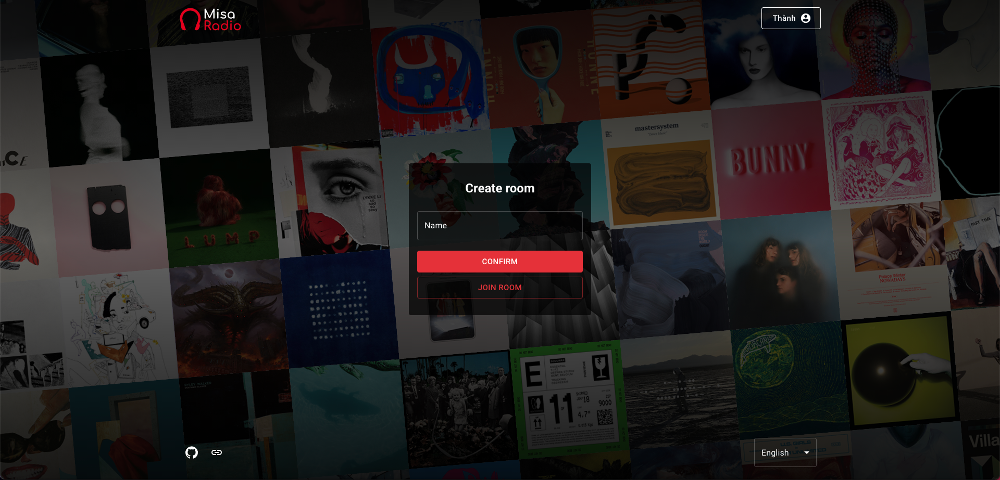

# Misa Radio

<p align="center">
  
</p>

## Overview

Create a room and listen to music with friends.

<p align="center">
  
</p>

## Features.

- Register / login by email or Google.
- Create room.
- Add music from Youtube.
- Mute and unmute.
- Skip.
- Language selection.

## Technologies

- [Next.js](https://github.com/vercel/next.js/)
- [Material UI](https://github.com/mui-org/material-ui)
- [Socket.IO](https://github.com/socketio/socket.io)
- [MongoDB](https://github.com/mongodb/mongo)

## Install

```
  $ git clone
  $ yarn install
  $ yarn build
  $ yarn start
```

## Data sources

- [Youtube](https://youtube.com/)

## Demo

- [Website](https://misaradio.herokuapp.com/)

## License

- [MIT](./LICENSE)
